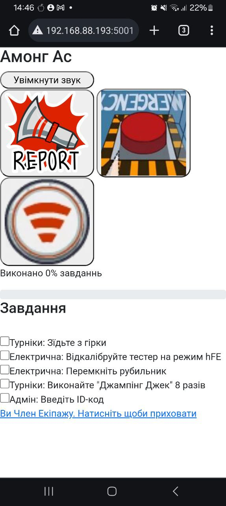

# Among Us в реальному житті

Це форк репозиторію [among-us-real-life](https://github.com/michaelgira23/among-us-real-life). Я доробив його для гри зі своїми друзями, але ви можете використовувати для особистого використаня.
## Можливості

-   Призначаня предателів/членів екіпажу
-   Призначання завдань
-   Глобальний прогрес завдань який заповнюється при їх виконанні.
-   Саботаж комунікації (тимчасово вимикає екстренну кнопку, приховує завдання і прогресс завдань)

## Скріншот



## Використаня

Цей сайт був створений для особистого використання, але ви також маєте можливість використовувати це для хостингу своєї гри.

### 1. Configure the game

Ви можете змінити значення у [`src/index.js`](https://github.com/michaelgira23/among-us-real-life/blob/master/src/index.js):

[`TASKS`](https://github.com/michaelgira23/among-us-real-life/blob/master/src/index.js#L14) - An array of strings that consist of all possible tasks. These will be randomly assigned to players.

[`N_TASKS`](https://github.com/michaelgira23/among-us-real-life/blob/master/src/index.js#L31) - Number of tasks to assign each player

[`N_IMPOSTORS`](https://github.com/michaelgira23/among-us-real-life/blob/master/src/index.js#L32) - Number of impostors to assign each round

### 2. Start the backend

Start the backend with

```
$ npm install
$ npm start
```

:information_source: Use a utility like [Nodemon](https://nodemon.io/) to automatically restart the backend upon any changes. This is useful when modifying the number of impostors or tasks.

### 3. Connect to the admin dashboard

Visit [http://localhost:4046/admin](http://localhost:4046/admin) to access the admin panel. There is a single button to start the game.

Pressing the start button will reset task progress, assign new tasks, and assign impostors. Press it once all players connect, otherwise you will have to press it again.

### 4. Invite friends to join

Players may access the the game at [http://localhost:4046](http://localhost:4046). On other computers (or phones), you will need to enter the computer's local IP or use a tunneling service like [ngrok](https://ngrok.com). Alternatively, you could deploy this yourself.

## Known issues

-   Деколи, гравцям назначаються одинакові завдання (помагає перезапуск гри)
-   На деяких Android телефонах, закриття браузера приводить до відключення від гри. Помагає зняття обмеження використання акумулятора браузером.
