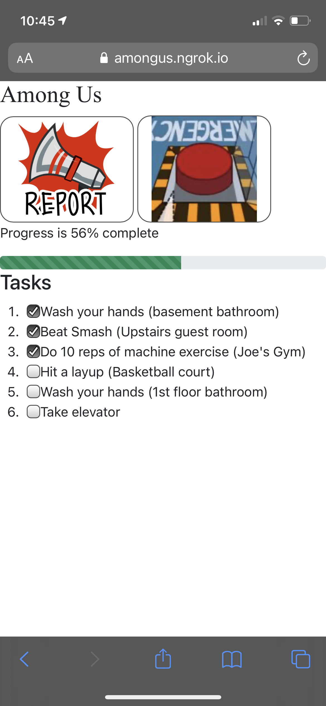

# Амонг ас в реальному житті

Форк репозиторію від michaelgira23

## Особливості

-   Призначати зрадників/членів екіпажу
-   Призначати завдання
-   Позначання завдань виконаними заповнює глобальну шкалу прогресу

Аудіо взято з [https://www.voicy.network/pages/among-us](https://www.voicy.network/pages/among-us)

## Скріншот (оригінал репозиторію)



## Використання

Я доповнив цей сайт для гри з друзями, але ви також можете використовувати цей репозиторій для гри з друзями

### 1. Конфігурація гри

Налаштувати гру можна [`src/index.js`](https://github.com/michaelgira23/among-us-real-life/blob/master/src/index.js):

[`TASKS`](https://github.com/michaelgira23/among-us-real-life/blob/master/src/index.js#L14) - Список всіх завданнь, що випадково призначаються кожному гравцеві

[`N_TASKS`](https://github.com/michaelgira23/among-us-real-life/blob/master/src/index.js#L31) - Кількість завданнь, що призначаються одному гравцеві.

[`N_IMPOSTORS`](https://github.com/michaelgira23/among-us-real-life/blob/master/src/index.js#L32) - Кількість зрадників.

### 2. Запустити бекенд

Запустіть бекенд використовуючи

```
$ npm install
$ npm start
```


### 3. Приєднайтесь до панелі керування

Зайдіть на [http://localhost:4046/admin](http://localhost:4046/admin) щоби отримати доступ до панелі керування. Тут є лише одна кнопка щоби почати гру.

Натиснення кнопки призведе до скидання шкали прогресу завдань, призначення нових предателів та нових задавннь. Натискайте її коли всі гравці приєднаються, інакше вам прийдеться нажати її ще раз.

### 4. Запросіть друзів

Гравці можуть отримати доступ до гри через [http://localhost:4046](http://localhost:4046). На інших комп’ютерах (або телефонах) вам потрібно буде ввести локальну IP-адресу комп’ютера або скористатися службою тунелювання, наприклад [ngrok](https://ngrok.com). Крім того, ви можете запустити сайт самостійно.

## Відомі баги

-   Деколи, завдання дублються. (В таких випадках, ми робили завдання двічі)
-   На деяких телефонах Android приховування веб-переглядача призведе до його перезагрузки, що призведе до втрати ваших завдань. (можна спробувати вимкнути оптимізацію батареї браузера)
